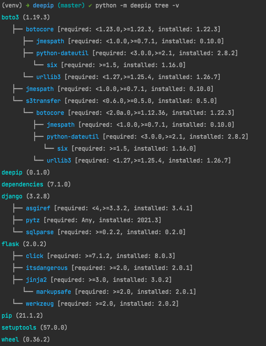

# deepip
Simple pet project for printing python dependency tree


## install

```bash
pip install git+https://github.com/Zwergpro/deepip.git
```

## usage

---
#### Show all dependency tree


#### Show dependency tree for specific package

